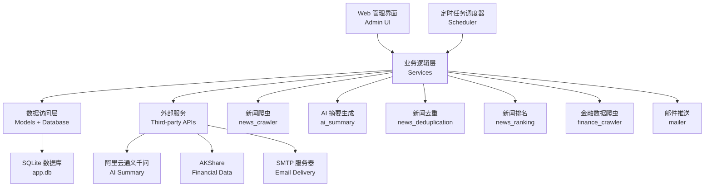
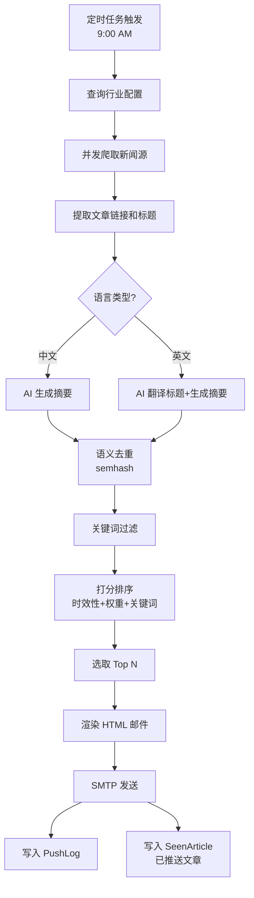
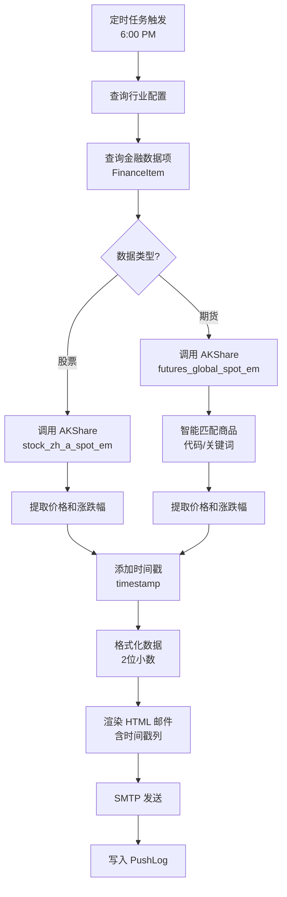
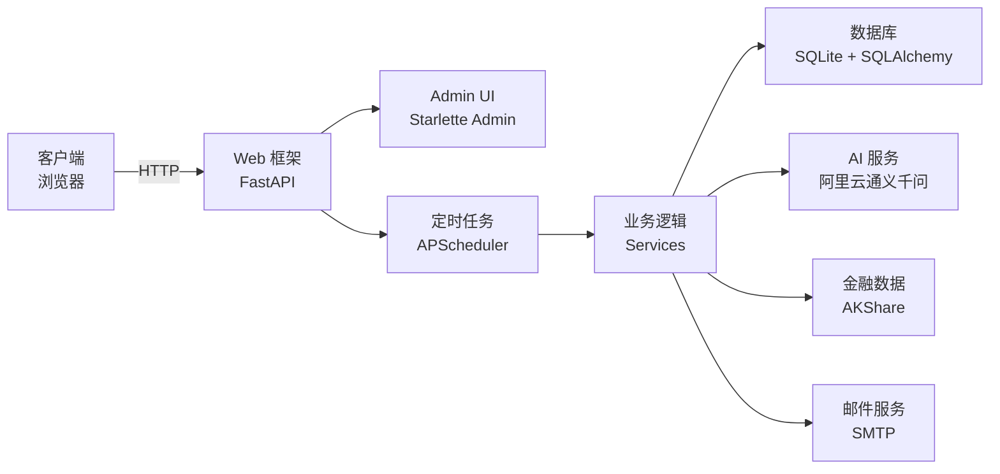
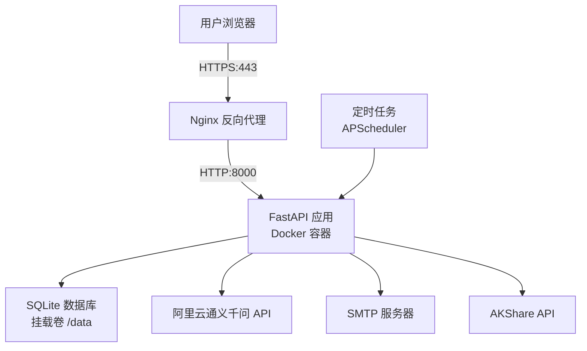

# 架构文档

**项目名称：** 多行业新闻与金融信息推送机器人
**最后更新：** 2026-02-20
**版本：** v1.2

---

## 一、应用架构

### 1.1 模块划分

系统采用分层架构，核心模块如下：



### 1.2 核心模块职责

| 模块 | 文件路径 | 职责 |
|------|---------|------|
| **Web 管理界面** | `backend/admin/views.py` | 提供 Admin 后台，管理行业、新闻源、收件人、推送计划等配置 |
| **定时任务调度器** | `backend/tasks/scheduler.py` | 使用 APScheduler 定时触发早报（9:00）和晚报（18:00）推送 |
| **新闻爬虫** | `backend/services/news_crawler.py` | 爬取新闻列表页，提取文章链接和标题，支持中英文源 |
| **AI 摘要生成** | `backend/services/ai_summary.py` | 调用通义千问 API，生成中文摘要；英文源时同时完成标题翻译 |
| **新闻去重** | `backend/services/news_deduplication.py` | 使用 semhash 进行语义去重，避免重复推送 |
| **新闻排名** | `backend/services/news_ranking.py` | 综合时效性、关键词匹配度、来源权重，计算文章得分并排序 |
| **金融数据爬虫** | `backend/services/finance_crawler.py` | 使用 AKShare 获取大宗商品价格和股票行情 |
| **邮件推送** | `backend/services/mailer.py` | 使用 Jinja2 模板渲染 HTML 邮件，通过 SMTP 发送 |
| **数据访问层** | `backend/models/*.py` | SQLAlchemy ORM 模型，定义数据库表结构 |
| **工具模块** | `backend/utils/*.py` | 加密（crypto）、SSRF 防护（ssrf_protection）、日志脱敏（log_sanitizer） |

### 1.3 数据流

#### 早报推送流程



#### 晚报推送流程



### 1.4 关键设计决策

#### ADR-001: SeenArticle 写入时机

**决策日期：** 2026-02-19
**状态：** 已采纳

**背景：** 最初设计中，SeenArticle 在爬取时写入，导致更新慢的来源（国家能源局、新华社）的文章被永久锁死，无法进入 Top 10。

**决策：** SeenArticle 改为在推送成功后写入，语义从"已爬取"改为"已推送"。

**影响：**
- 每次爬取时，所有来源的文章都重新参与排名
- 只有真正推送过的文章才被排除
- 来源多样性问题得到根治

**相关提交：** `96a36d9`

---

#### ADR-002: 英文新闻源翻译策略

**决策日期：** 2026-02-19
**状态：** 已采纳

**背景：** 需要接入英文能源新闻网站（IEA News、Clean Energy Wire 等），并将英文标题和摘要翻译为中文后推送。

**决策：**
- NewsSource 增加 `language` 字段（默认 `zh`，可选 `en`）
- 英文源时，一次 AI 调用同时完成「标题翻译 + 内容摘要」，减少 API 成本
- 翻译后的中文标题和摘要与中文源文章一起参与排名

**备选方案：**
- 方案 B：自动检测语言（使用 langdetect）— 被拒绝，因为短文本准确率低且不可控

**影响：**
- 支持中英文双语新闻源
- 翻译准确率 100%（10/10 验证通过）
- 一次 AI 调用完成翻译+摘要，成本可控

**相关提交：** `a4ef31e`, `f8c5e3a`, `3d2a1b4`

---

#### ADR-003: HTTPS 传输加密实现方案

**决策日期：** 2026-02-20
**状态：** 已采纳

**背景：** ECS 管理界面使用 HTTP 明文传输，存在安全风险：
- 管理员登录密码、SMTP 配置等敏感信息可能被中间人截获
- 浏览器显示"不安全"警告，影响用户体验
- ECS 无域名，无法申请 Let's Encrypt 等受信任证书

**决策：** 采用自签名 SSL 证书实现 HTTPS
- 使用 OpenSSL 生成 RSA 2048 证书（有效期 365 天）
- Nginx 配置 TLS 1.2/1.3 加密传输
- HTTP 强制跳转到 HTTPS（301 重定向）
- 浏览器首次访问需手动信任证书

**备选方案：**
- 方案 A：Let's Encrypt + 自动续期 — 被拒绝，因为需要域名
- 方案 B：阿里云免费 SSL 证书 — 被拒绝，因为需要域名

**影响：**
- 提供与正规证书相同的加密强度（TLS 1.2/1.3 + RSA 2048）
- 防止中间人攻击，保护敏感信息传输
- 浏览器会显示证书警告（可通过手动信任解决）
- 证书需每年续期（365 天有效期）

**相关提交：** `d4747e9`

---

#### ADR-004: 晚报金融数据时间戳与期货API修复

**决策日期：** 2026-02-20
**状态：** 已采纳

**背景：** 用户收到晚报邮件后发现两个问题：
1. 缺少大宗商品（期货）数据 - 原因是 `futures_zh_spot()` API 失效
2. 所有金融信息都缺少时间戳 - 无法判断数据获取时间

**决策：**
- **时间戳功能**：`FinanceQuote` 数据类新增 `timestamp: datetime` 字段，所有数据获取函数返回时添加 `datetime.now()`，邮件模板新增「数据时间」列
- **期货 API 修复**：放弃失效的 `futures_zh_spot()` API，改用 `futures_global_spot_em()` 获取全球商品现货数据（620个商品），实现智能匹配逻辑

**智能匹配策略：**
1. 优先按代码精确匹配（如 LCPT, LALT）
2. 其次按名称关键词模糊匹配（铜/Copper/Cu, 铝/Aluminum/Al）
3. 优先选择"综合"品种（主力品种）

**商品代码映射：**
- `cu2505` (沪铜期货) → 综合铜03 (LCPT) ✅
- `al2505` (沪铝期货) → 综合铝03 (LALT) ✅
- `lc2506` (碳酸锂期货) → ❌ 数据不可用（价格为 NaN）

**备选方案：**
- 方案 A：升级 AKShare - 被拒绝，最新版仍有相同问题
- 方案 B：使用 `futures_zh_spot()` - 被拒绝，已失效（Length mismatch 错误）

**影响：**
- 所有金融数据包含获取时间，提升数据可信度
- 期货数据获取成功率：2/3（铜铝可用，锂暂不可用）
- 邮件模板新增时间戳列，格式为 `HH:MM:SS`
- 价格和涨跌幅统一保留 2 位小数

**遗留问题：**
- 碳酸锂数据暂时不可用，需后续调研替代方案（第三方API、交易所官方数据、现货价格平台）

**相关提交：** `87d86a3`

---

## 二、技术架构

### 2.1 技术栈



### 2.2 核心技术选型

| 技术 | 版本 | 选型理由 |
|------|------|----------|
| **Python** | 3.11+ | 生态丰富，适合数据处理和爬虫开发 |
| **FastAPI** | 0.115.6 | 高性能异步框架，自动生成 API 文档 |
| **SQLAlchemy** | 2.0.36 | 成熟的 ORM，支持异步操作 |
| **SQLite** | - | 轻量级数据库，适合单机部署，无需额外维护 |
| **Starlette Admin** | 0.14.1 | 快速构建 Admin 后台，支持 CRUD 和权限管理 |
| **APScheduler** | 3.10.4 | 灵活的定时任务调度器，支持 Cron 表达式 |
| **BeautifulSoup4** | 4.12.3 | HTML 解析，提取新闻链接和正文 |
| **httpx** | 0.28.1 | 异步 HTTP 客户端，支持并发爬取 |
| **semhash** | 0.3.0 | 语义哈希，用于新闻去重 |
| **AKShare** | 1.18.25 | 国产开源金融数据库，支持股票、期货、大宗商品 |
| **阿里云通义千问** | dashscope 1.20.11 | AI 摘要生成和英文翻译，成本低于 Claude |
| **Jinja2** | 3.1.4 | 模板引擎，渲染 HTML 邮件 |
| **cryptography** | 43.0.3 | 加密敏感信息（SMTP 密码、邮箱地址） |

### 2.3 外部服务依赖

| 服务 | 用途 | 配置项 |
|------|------|--------|
| **阿里云通义千问** | AI 摘要生成、英文翻译 | `DASHSCOPE_API_KEY` |
| **SMTP 服务器** | 邮件发送 | `SMTP_HOST`, `SMTP_PORT`, `SMTP_USER`, `SMTP_PASSWORD` |
| **AKShare** | 金融数据获取 | 无需配置，直接调用 |

### 2.4 安全机制

| 机制 | 实现 | 文件路径 |
|------|------|----------|
| **HTTPS 传输加密** | TLS 1.2/1.3 加密传输，防止中间人攻击 | `nginx/conf.d/app.conf` |
| **敏感信息加密** | 使用 Fernet 对称加密存储 SMTP 密码和邮箱地址 | `backend/utils/crypto.py` |
| **SSRF 防护** | 爬虫 URL 白名单校验，禁止访问内网地址 | `backend/utils/ssrf_protection.py` |
| **日志脱敏** | 自动移除日志中的邮箱、密码等敏感信息 | `backend/utils/log_sanitizer.py` |
| **依赖漏洞扫描** | 使用 pip-audit 定期扫描依赖漏洞 | `requirements.txt` |

---

## 三、部署架构

### 3.1 部署拓扑



### 3.2 运行环境

| 环境 | 配置 |
|------|------|
| **操作系统** | Linux（ECS）或 macOS（本地开发） |
| **Python 版本** | 3.11+ |
| **容器化** | Docker + Docker Compose |
| **Web 服务器** | Nginx（反向代理，HTTPS 终止，TLS 1.2/1.3） |
| **应用服务器** | Uvicorn（ASGI 服务器） |
| **SSL/TLS** | 自签名证书（RSA 2048）或 Let's Encrypt |

### 3.3 构建与部署

#### 本地开发

```bash
# 1. 安装依赖
python -m venv .venv
source .venv/bin/activate
pip install -r requirements.txt

# 2. 配置环境变量
cp .env.example .env
# 编辑 .env，填写 DASHSCOPE_API_KEY 等配置

# 3. 初始化数据库
python -c "import asyncio; from backend.database import init_db; asyncio.run(init_db())"

# 4. 启动应用
uvicorn backend.app:app --reload --host 0.0.0.0 --port 8000
```

#### Docker 部署

```bash
# 1. 构建镜像
docker-compose build

# 2. 启动容器
docker-compose up -d

# 3. 查看日志
docker-compose logs -f app
```

#### ECS 生产部署

```bash
# 1. SSH 到 ECS
ssh root@<ECS-IP>

# 2. 拉取最新代码
cd /opt/news-bot
git pull

# 3. 生成 SSL 证书（首次部署或证书过期时）
mkdir -p ssl
openssl req -x509 -nodes -days 365 -newkey rsa:2048 \
  -keyout ssl/selfsigned.key \
  -out ssl/selfsigned.crt \
  -subj "/C=CN/ST=Beijing/L=Beijing/O=NewsBot/CN=$(curl -s ifconfig.me)"

# 4. 重新构建并启动
docker compose build app
docker compose up -d

# 5. 验证服务
curl -k https://localhost/health
# 应返回：{"status":"ok"}

# 6. 验证 HTTP 跳转
curl -I http://localhost/admin
# 应返回：301 Moved Permanently，Location: https://...
```

**注意事项：**
- 首次部署需在阿里云控制台开放 443 端口（入方向规则）
- 自签名证书有效期 365 天，需定期续期
- 浏览器首次访问会显示证书警告，点击"继续访问"即可
- 生产环境建议使用域名 + Let's Encrypt 证书

### 3.4 配置管理

| 配置项 | 存储位置 | 说明 |
|--------|---------|------|
| **环境变量** | `.env` 文件 | 本地开发使用，不提交到 Git |
| **数据库** | `data/app.db` | SQLite 数据库文件，Docker 挂载卷 |
| **日志** | `logs/` 目录 | 应用日志，Docker 挂载卷 |
| **SMTP 配置** | 数据库 `smtp_config` 表 | 加密存储，通过 Admin 后台配置 |
| **SSL 证书** | `ssl/` 目录 | 自签名证书，不提交到 Git，有效期 365 天 |

### 3.5 数据持久化

| 数据类型 | 存储位置 | 备份策略 |
|---------|---------|----------|
| **数据库** | `data/app.db` | 定期备份到云存储 |
| **日志** | `logs/*.log` | 按日期轮转，保留 30 天 |
| **推送记录** | 数据库 `push_log` 表 | 永久保留 |
| **已推送文章** | 数据库 `seen_article` 表 | 永久保留（去重依据） |
| **SSL 证书** | `ssl/*.{crt,key}` | 365 天有效期，过期前需重新生成 |

---

## 四、架构演进记录

### v1.2 (2026-02-20)

**新增功能：**
- 晚报金融数据时间戳支持
- 期货数据 API 修复（智能匹配）

**架构决策：**
- ADR-004: 晚报金融数据时间戳与期货API修复

**技术变更：**
- `FinanceQuote` 数据类新增 `timestamp` 字段
- 放弃失效的 `futures_zh_spot()` API，改用 `futures_global_spot_em()`
- 实现智能匹配逻辑（代码精确匹配 + 关键词模糊匹配）
- 邮件模板新增时间戳列（`HH:MM:SS` 格式）
- 金融数据精度统一保留 2 位小数

**相关提交：** `87d86a3`

---

### v1.1 (2026-02-20)

**新增功能：**
- HTTPS 传输加密支持
- 自签名 SSL 证书生成

**架构决策：**
- ADR-003: 采用自签名证书实现 HTTPS（无域名场景）

**技术变更：**
- Nginx 配置：增加 HTTPS 监听（443 端口）和 TLS 1.2/1.3 支持
- Docker Compose：增加 443 端口映射和 SSL 证书目录挂载
- HTTP 强制跳转到 HTTPS（301 重定向）

**相关提交：** `d4747e9`

---

### v1.0 (2026-02-19)

**新增功能：**
- 多行业新闻与金融信息推送
- 中英文双语新闻源支持
- AI 摘要生成和英文翻译
- 新闻去重和排名机制
- Web 管理界面

**架构决策：**
- ADR-001: SeenArticle 写入时机改为推送后
- ADR-002: 英文新闻源翻译策略（language 字段 + 一次 AI 调用）

**技术栈：**
- FastAPI + SQLAlchemy + SQLite
- 阿里云通义千问（AI 摘要）
- AKShare（金融数据）
- Docker + Nginx（部署）
